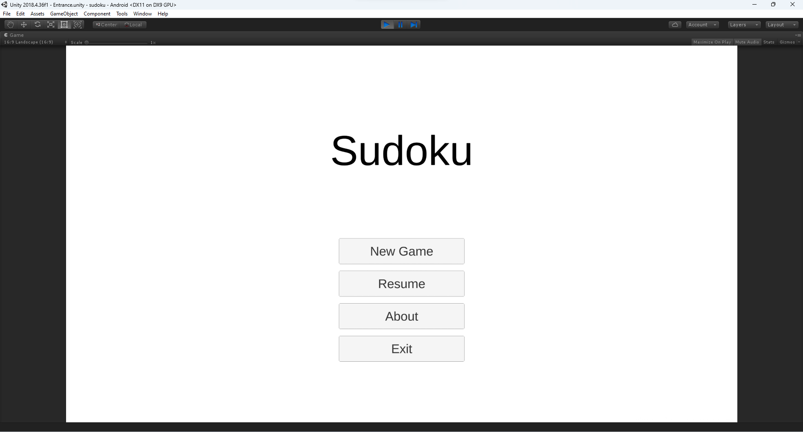
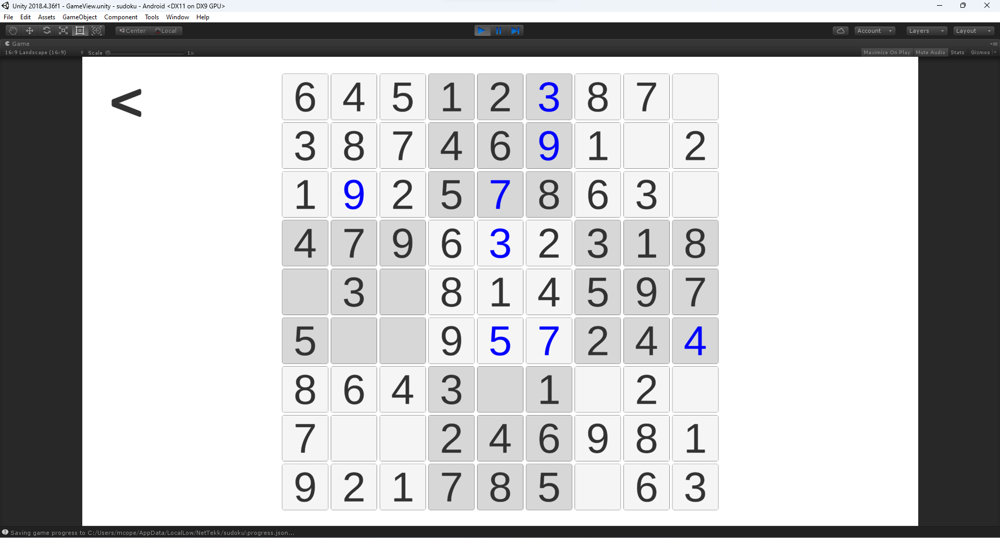
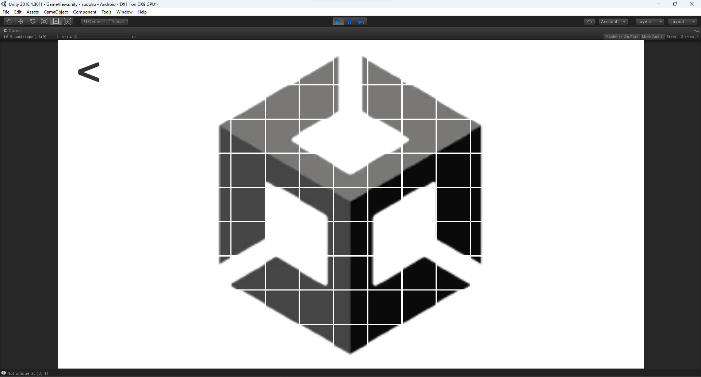

# sudoku

A classic sudoku game with adaptive layout made with Unity 2018.4.36f1

## Usage

Load the repo with Unity 2018.4.36f1. Anything else you want to do is up to you.

This game is tested running well on Windows, Android and WebGL.

## Screenshots

## License

This repository is licensed to you under [MIT license](./LICENSE).

---

2023, net2cn.
